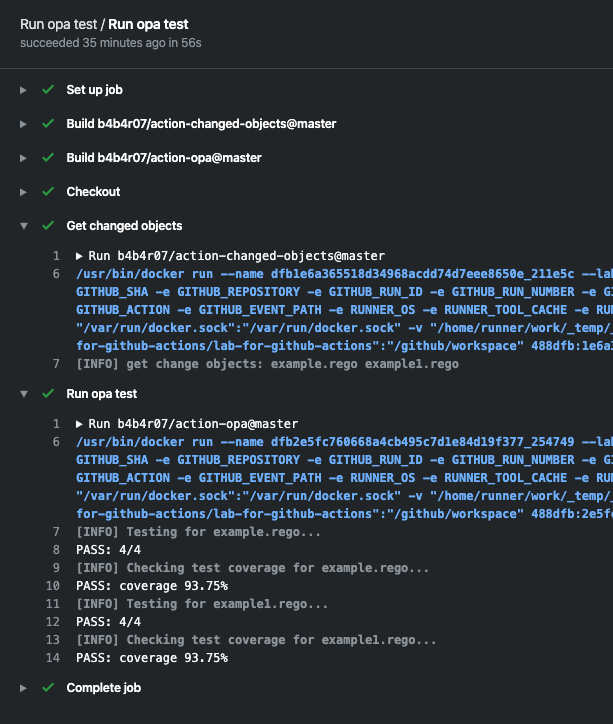

action-opa
==========

[](https://github.com/b4b4r07/action-opa/releases)



Run [opa test](https://www.openpolicyagent.org/docs/latest/policy-testing/) command with GitHub Actions

You can use the fixed version from: [Releases](https://github.com/b4b4r07/action-opa/releases/latest)

## Usage

A whole example is here:

```yaml
name: Run opa test

on:
  push:
    branches:
      - '*'
      - '!master'

jobs:
  test:
    runs-on: ubuntu-latest
    name: Run opa test
    steps:
    - name: Checkout
      uses: actions/checkout@v1
    - name: Get changed objects
      uses: b4b4r07/action-changed-objects@master
      with:
        added: 'true'
        deleted: 'false'
        modified: 'true'
      id: objects
    - name: Run opa test
      uses: b4b4r07/action-opa@master
      if: steps.objects.outputs.changed
      with:
        path: .
        coverage: 90%
        files: ${{ steps.objects.outputs.changed }}
```

If you want to test [opa](https://github.com/open-policy-agent/opa)/[conftest](https://github.com/instrumenta/conftest) policies against only changed files, you need to use [b4b4r07/action-changed-objects](https://github.com/b4b4r07/action-changed-objects) to get the changed files in Git commit. It defaults to compare with checkout-ed branch and origin/master branch.

BTW, you want the example rego files:

<details><summary><code>example.rego</code></summary>
</br>

```rego
package authz

allow {
    input.path == ["users"]
    input.method == "POST"
}

allow {
    some profile_id
    input.path = ["users", profile_id]
    input.method == "GET"
    profile_id == input.user_id
}
```

</details>

<details><summary><code>example_test.rego</code></summary>
</br>

```rego
package authz

test_post_allowed {
    allow with input as {"path": ["users"], "method": "POST"}
}

test_get_anonymous_denied {
    not allow with input as {"path": ["users"], "method": "GET"}
}

test_get_user_allowed {
    allow with input as {"path": ["users", "bob"], "method": "GET", "user_id": "bob"}
}

test_get_another_user_denied {
    not allow with input as {"path": ["users", "bob"], "method": "GET", "user_id": "alice"}
}
```

</details>

```console
$ docker run -v $(pwd):/tests openpolicyagent/opa test -v /tests/example.rego /tests/example_test.rego
data.authz.test_post_allowed: PASS (2.3088ms)
data.authz.test_get_anonymous_denied: PASS (765.8µs)
data.authz.test_get_user_allowed: PASS (880.2µs)
data.authz.test_get_another_user_denied: PASS (1.1077ms)
--------------------------------------------------------------------------------
PASS: 4/4
```

## Customizing

### inputs

The following are optional as `step.with` keys

| Name       | Type   | Description                                                       | Default |
| ---------- | ------ | ----------------------------------------------------------------- | ------- |
| `path`     | String | Path to directory where rego files are located                    | `.`     |
| `coverage` | String | Percentage of test coverage to require                            | `80%`   |
| `files`    | String | Files subject to OPA testing. List should be separated by a space | (n/a)   |

When providing a `path` and `files` at the same time, `files` will be attempted first, then falling back on `path` if the files can not be got from.

### outputs

The following outputs can be accessed via `${{ steps.<step-id>.outputs }}` from this action

| Name | Type | Description |
| ---- | ---- | ----------- |
| n/a  | n/a  | n/a         |

### environment variables

The following are as `step.env` keys

| Name | Description |
| ---- | ----------- |
| n/a  | n/a         |

## License

[MIT](https://b4b4r07.mit-license.org/)
